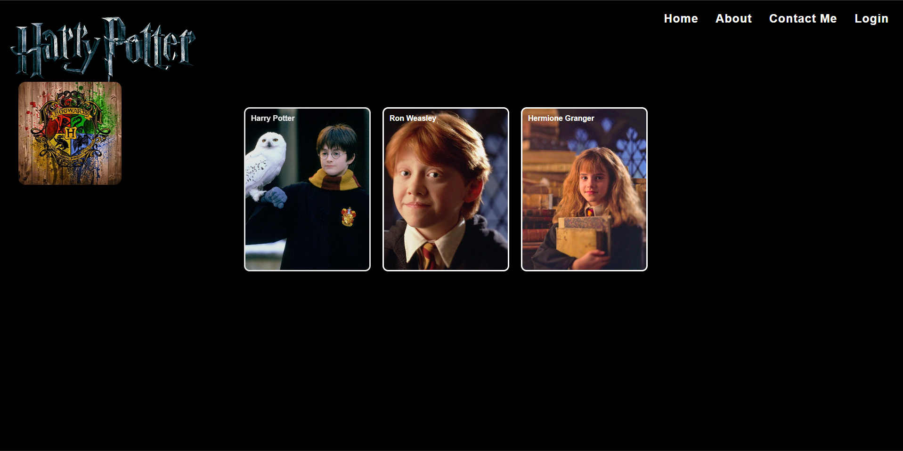

# hogwarts-website

A Harry Potter themed static website built using HTML and CSS. The project showcases fundamental web development concepts including page structuring, navigation, styling, image integration, and responsive design basics.

<h1 align="center">Hogwarts Website</h1>

<h3 align="center">
A Harry Potter Inspired Static Website using HTML & CSS
</h3>

<p align="center">
  
  
  
</p>

---

## Overview

This project was developed as part of my early web development learning journey.

The website is inspired by the Harry Potter universe and includes multiple web pages featuring Hogwarts-themed content, character sections, custom styling, images, and navigation components.

The project focuses on learning:

* HTML Page Structure
* CSS Styling
* Navigation Menus
* Image Integration
* Layout Design
* Frontend Development Fundamentals

---
## Website Preview

<p align="center">
  
</p>

---
## Website Features

* Multi-Page Website
* Hogwarts Themed Design
* Character Pages
* Custom CSS Styling
* Navigation Bar
* Image Gallery
* Beginner-Friendly Frontend Structure

---

## Project Structure

```bash
hogwarts-website/
│
├── index.html
├── Login.html
├── Contact.html
│
├── style.css
├── style_0.css
│
├── logo.png
├── hogwarts.jpg
├── harry_img.jpg
├── hermione_img.jpg
├── ron_img.webp
│
└── README.md
```


---

## Technologies Used

* HTML
* CSS
* Web Design Fundamentals
* Frontend Development

---

## Learning Outcomes

Through this project I learned:

* Creating multi-page websites
* Structuring webpages using HTML
* Styling webpages using CSS
* Working with images and media
* Designing navigation menus
* Organizing frontend project files

---

## Getting Started

Clone the repository:

```bash
git clone https://github.com/your-username/hogwarts-website.git
```

Open:

```bash
index.html
```

in your browser to view the website.

---

## Future Improvements

* Responsive Design
* JavaScript Interactivity
* Animations and Effects
* Dark Mode Support
* Improved UI/UX Design
* Mobile Optimization

---

## Note

This project represents one of my early web development projects and serves as a milestone in my learning journey with HTML and CSS.
